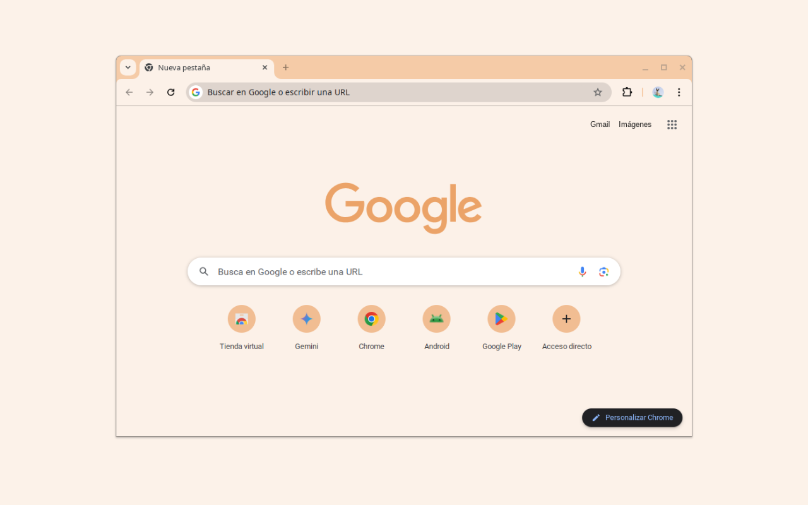

# Minimalist Orange Juice 🍊

The official Minimalist Orange Juice theme for Chromium-based browsers. A minimalist theme with a color palette inspired by Orange Juice, designed for a serene and elegant browsing experience.

 

---

## 🛡️ Official Derivatives Policy

This software is released under the **GNU General Public License v3.0 (GPLv3)**.

In addition to the terms of the GPLv3:

1. **Author Attribution:** You must give appropriate credit to the original author, **Miguel Euraque**, provide a link to this official repository, and indicate if changes were made.
2. **Naming Derivative Works:** To prevent user confusion and protect the project's integrity, you may **not** name your derivative work using the "Minimalist" brand name or any other name that implies it is the original work, an official version, or endorsed by the original author. For example, you may **not** name your derivative work "Minimalist Orange Juice Pro" or "Official Minimalist Theme".
3. **Clear Differentiation:** If you distribute a modified version, you must clearly label it as a **"modified version of Minimalist Orange Juice by Miguel Euraque"**.

These conditions are based on the author's right to protect the integrity of their work and prevent misrepresentation.

## 🎨 Features

- **Color Palette:** Soft shades of Orange Juice and neutrals
- **Minimalist Design:** Clean and modern interface
- **Easy Installation:** Compatible with Chrome Manifest V3
- **Customization:** Harmonious colors that reduce eye strain

## 📦 Installation

### Direct Download (Recommended)

1. Download the `.crx` file from the [Official Website](https://vidaextrema.org/minimalist/).
2. Open `chrome://extensions` in your browser.
3. Enable **Developer mode** (toggle in the top right).
4. Drag and drop the downloaded `.crx` file onto the extensions page.

### From Source

1. Clone this repository.
2. Open `chrome://extensions` and enable Developer mode.
3. Click "Load unpacked" and select the theme folder.

## 📜 License Change Notice

Previous private versions of this code used a modified MIT license. As of this first public release, the project is now licensed under the **GNU General Public License v3.0**. This change strengthens the commitment to open collaboration and protects the project from misappropriation.

## 👤 Author

**Miguel Euraque**

_Teacher, Technical SEO and Web Developer._

I transform ideas into robust and visible digital experiences. My work focuses on the intersection between technology and education, with the goal of democratizing knowledge and making the web a more inclusive space.

I am passionate about creating open projects that promote collaboration, learning, and accessibility. I believe that code and the web are powerful tools for expanding horizons, connecting people, and building a more equitable digital future.

- **Website:** [Vida Extrema](https://vidaextrema.org/)
- **GitHub:** [mykeura](https://github.com/mykeura)

## 🔗 More Themes

Explore more themes from the Official Minimalist Collection on [Minimalist themes](https://vidaextrema.org/minimalist/).

---

*This is the official repository. For support, questions, or to verify authenticity, please visit the official source.*
