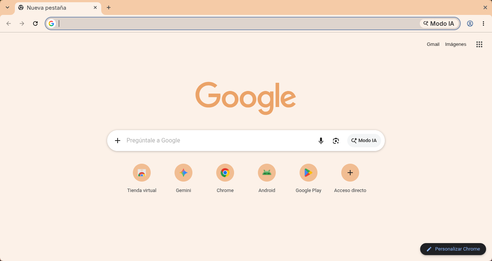

# Minimalist Orange Juice

A minimal Chrome theme in a gentle, orange palette, by Miguel Euraque.

A soft peach frame, a pale cream-orange toolbar and new tab page, and warm gray text. It is the gentle orange of orange juice, fresh and warm without shouting.

## Features

- **Palette:** soft peach frame, pale cream-orange surfaces, warm gray text
- **Minimalist design:** clean and uncluttered
- **Easy installation:** Chrome Manifest V3
- **Gentle on the eyes:** low-contrast colors that stay easy to read

## Installation

### Chrome Web Store (recommended)

1. Visit the [Minimalist Orange Juice](https://chromewebstore.google.com/detail/minimalist-orange-juice/cphbblmnejdobpelaamimglcmjkcccnj) page in the Chrome Web Store.
2. Click **Add to Chrome**.

### From source

1. Clone this repository.
2. Open `chrome://extensions` and turn on Developer mode.
3. Click **Load unpacked** and select the theme folder.
